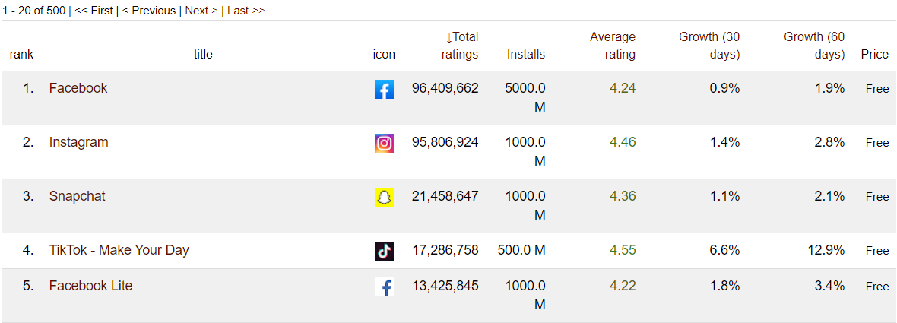

# Project of Data Visualization (COM-480)

| Student's name | SCIPER |
| -------------- | ------ |
|     Kooli      | 269603 |
|     Wildi      | 260594 |
|     Schmider   | 274431 |

[Milestone 1](#milestone-1-friday-3rd-april-5pm) • [Milestone 2](#milestone-2-friday-1st-may-5pm) • [Milestone 3](#milestone-3-thursday-28th-may-5pm)

## Milestone 1 (Friday 3rd April, 5pm)

### 1. Dataset
We chose to devote our data visualization project to Android applications. Our data comes from the website [androidrank.org](https://www.androidrank.org), which displays in a very clean manner open information about the 500 most downloaded apps in each category of the Google Play Store. The characteristics provided are the following: number of ratings and installs, average rating, growth in number of reviews for the last 30 and 60 days and finally price. Here is an example of what it looks like :

The chosen data will not require much pre-processing as it was already well-structured but did require a certain amount of time of scraping. We chose this solution over the existing dataset [Google Play Store Apps](https://www.kaggle.com/lava18/google-play-store-apps) available on Kaggle, because there was no indication on how the selection of the 10’000 apps it presents was made, thus hindering the possibility of displaying meaningful informations from it.

Besides, the data provided on [androidrank.org](https://www.androidrank.org) are up-to-date, which is a considerable advantage in the context of the ever-changing market that are mobile applications. Finally, an API is provided to get more details about the evolution of a particular application, for instance the dates when the app crossed the different number of installations milestones as well as the evolution of the distribution of ratings. This would allow us to do add a more in-depth visualization for a selected group of apps.

### 2. Problematic
We will thus try to show what makes an app successful, especially what are the key characteristics of an app (prize, genre, etc.) that have the greater importance in an app’s success. For the most successful apps, we will also try to visualize and compare the evolution of this success during time.

This is moreover something that could be interesting to anyone since nowadays more than 40% of the population owns a smartphone, in which apps hold a very significant place. This is the reason why we chose to display the results in the form of a smartphone. This idea is more developed in the 4th part, and will be even more explained in the Milestone 2.

### 3. Exploratory Data Analysis
We started the exploration of the dataset with some basic statistics to have a general idea of what we were dealing with. You can find all the initial analysis on the Python notebook [analysis2.ipynb](analysis2.ipynb) with comments that describe all the processing.

The used dataset was generally clean and ready-to-use as explained before, but because of a limited number of requests during the parsing, the data had to be acquired in a few steps. The saved dataframes were then merged together, removing the potential duplicates. 

After that, we started to analyze the data by proceeding to basic statistics. We could for instance see that only 0.5% of apps in the dataset are paid apps, which was less than we expected. Moreover, we observed that looking at the most installed apps and the most reviewed ones gives two different rankings, which shows that ranking the apps could maybe be done using a balance between the two criteria.

Finally, after analyzing the growth of the apps reviews, we saw that some unexpected (according to us) categories had the higher growth such as *Art & Design* or *Video Players*. The growth of the latter may be explained by the containment that led many people to actively watch videos through apps. Let's note that the growth is sometimes not very representative since it's only a percentage and thus going from 0 to 1’000 reviews give a much higher growth than going from 1’000’000 to 1’001’00 reviews. So we will have to also find a balance in order to include this parameter in our analysis.

### 4. Related Work
We can easily find a few plots showing the most successful apps on the stores. However most of them are only based on the number of downloads. After starting to explore the dataset (cf. part 3), we started to think of a more complete score, meaning that our ranking of the most successful apps will not only be based on the downloads but also on other criteria such as ratings. This way, we could maybe have a more representative ranking of the apps success.

Moreover, as explained previously, the data will be displayed in the form of a smartphone where its apps will give access to the visualised results. It will then be directly related to the content itself and will also make the interface more user-friendly. People using the data will find it easy to jump from a result to another since they are used to this kind of interaction with their own smartphone, but the concept will this time be used as a data visualization technique.

## Milestone 2 (Friday 1st May, 5pm)

The Milestone 2 report can be found on the following file: [milestone2.pdf](milestone2.pdf)

Useful links: 
- Website: http://appoffame.github.io/
- Website's repository: https://github.com/AppOfFame/AppOfFame.github.io

## Milestone 3 (Thursday 28th May, 5pm)

Our Process Book can be found on the following file: [Javastreet_ProcessBook.pdf](Javastreet_ProcessBook.pdf)

The other deliverables are available on the following links :
- Screencast: 
- Website: http://appoffame.github.io/ (designed to be viewed on Google Chrome)
- Website's repository: https://github.com/AppOfFame/AppOfFame.github.io

**80% of the final grade**

